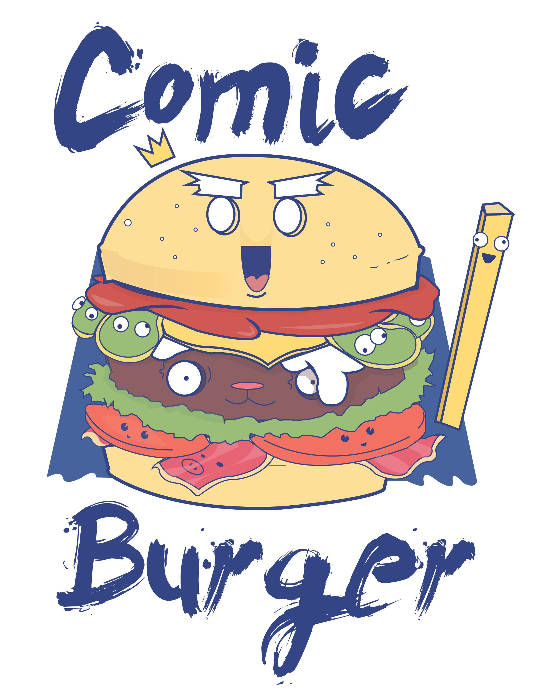
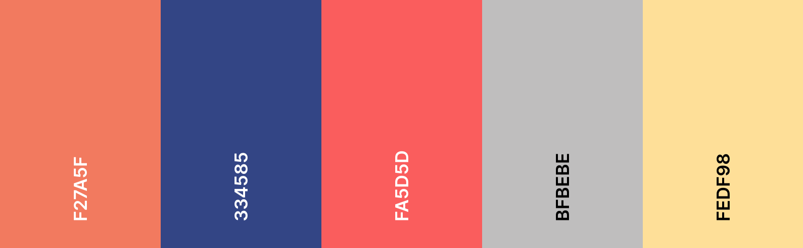
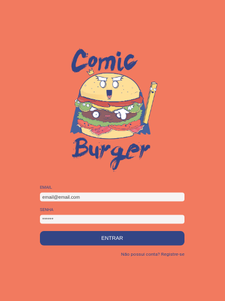
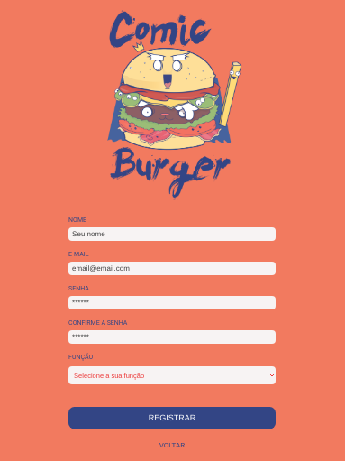
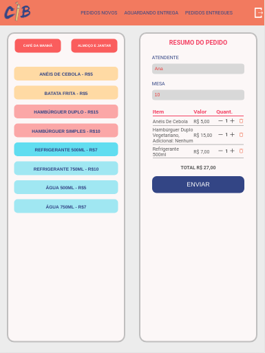
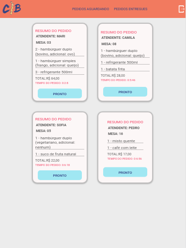
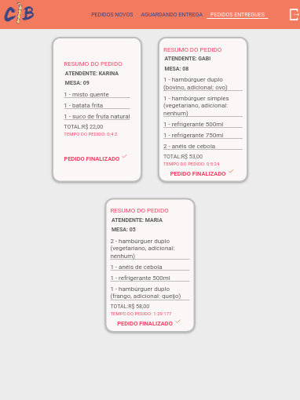

# <p align='center'></p>

#### Para acessar a aplicação [clique aqui](https://comic-burger.web.app/) :computer: 

```
Login para teste

Salão  
Login - salao@salao.com  
Senha - 123456

Cozinha
Login - cozinha@cozinha.com  
Senha - 123456 
```
## Índice

[Introdução](#introdução-hamburger) | [Sobre o projeto](#sobre-o-projeto) | [Criação e desenvolvimento](#criação-e-desenvolvimento) | [Considerações gerais](#considerações-gerais) | [Estrutura e funcionalidades](#estrutura-e-funcionalidades) | [Instalação e execução](#instalação-e-execução-octocat) | [Tecnologias e bibliotecas utilizadas](#tecnologias-e-bibliotecas-utilizadas-star) | [Implementações futuras](#implementações-futuras) 

---

## Introdução :hamburger:

Interface _web_ para processamento e envio dos pedidos de uma hamburgueria, de forma ordenada e eficiente.  
Desenvolvido com React, preferencialmente para _tablets_, mas também responsivo para _mobile_ e _web_.

## Sobre o projeto

Um pequeno restaurante, que está crescendo, necessita uma interface em que se possa realizar pedidos utilizando um _tablet_, e enviá-los para a cozinha para que sejam preparados de forma ordenada e eficiente.

A interface deve mostrar os dois menus (café da manhã e restante do dia), cada um com todos os seus _produtos_.  
O usuário deve poder escolher que _produtos_
adicionar e a interface deve mostrar o _resumo do pedido_ com o custo total em tempo real.

## Criação e desenvolvimento.

### Sobre o nome

> **Comics** é um meio utilizado para expressar narrativas ou outras ideias por meio de imagens, geralmente combinadas com texto. Desenhos animados e outras formas de ilustração são os meios mais comuns de criação de comics.

### Paleta de cores



## Considerações gerais

A lógica do projeto foi implementada em JavaScript (ES6 +) e [React](https://reactjs.org/), e incluí o conceito de estado da tela, e como cada mudança no estado reflete na interface.

A aplicação é uma _Single Page App_, responsiva para _web_, _tablets_ e _mobile_.

O _Product Owner_ nos apresentou o _backlog_, e o desenvolvimento foi realizado por meio de Histórias de Usuário, com critérios de aceitação e definição de pronto.

## Estrutura e funcionalidades

### Login e Registro

É possível realizar o registro dos funcionários de acordo com sua função, definindo as páginas que ele terá acesso.

 

### Salão

No Salão é possível realizar os pedidos, alterando a quantidade, excluindo os produtos e incluindo opcionais.  
Também é possível verificar os pedidos aguardando entrega e o histórico.



### Cozinha

Na Cozinha é possível verificar os pedidos aguardando preparo e o histórico.



### Histórico

Histórico de pedidos que já foram finalizados.



## Instalação e execução :octocat:

- Clone o projeto na sua máquina executando o seguinte comando no seu terminal:

```sh
git clone https://github.com/camilagerarde/SAP004-burger-queen
```

- Instale as dependências do projeto com o comando:

```sh
npm install
```

- Rode o projeto na sua máquina com:

```sh
npm run start
```

- E visualize o projeto no seu navegador com o link:

```sh
http://localhost:3000
```

### Para a visualização do Storybook

> Storybook é uma ferramenta _open source_ para o desenvolvimento de componentes de IU isoladamente para React, Vue, Angular e muito mais.  
> Isso torna a criação de interfaces de usuário impressionantes organizada e eficiente.

- Execute o comando no terminal

```sh
npm run storybook
```

- E visualize no seu navegador com o link:

```sh
http://localhost:9009
```

## Tecnologias e bibliotecas utilizadas :star:

- [React](https://reactjs.org/)
- [React Hooks](https://pt-br.reactjs.org/docs/hooks-intro.html)
- [React Router](https://reactrouter.com/web/guides/quick-start)
- [CSS Modules](https://create-react-app.dev/docs/adding-a-css-modules-stylesheet/)
- [Babel](https://babeljs.io/)
- [Webpack](https://webpack.js.org/)
- [Firebase](https://firebase.google.com/)
- [Storybook](https://storybook.js.org/)
- [Prop-types](https://www.npmjs.com/package/prop-types)
- [Sweet Alert2](https://sweetalert2.github.io/)
- [Dayjs](https://www.npmjs.com/package/dayjs)
- [Eslint](https://www.npmjs.com/package/eslint-plugin-react)

## Implementações futuras

- Aprimoramento do timer.
- Filtros no histórico de pedidos.
- Alerta para pedidos pendentes e prontos.
- Testes.

**Projeto realizado por [Camila Cunha](https://github.com/camilagerarde) e [Sofia Simas](https://github.com/SofiaSimas) para o Bootcamp da [Laboratória](https://github.com/Laboratoria).**

[](https://forthebadge.com)
